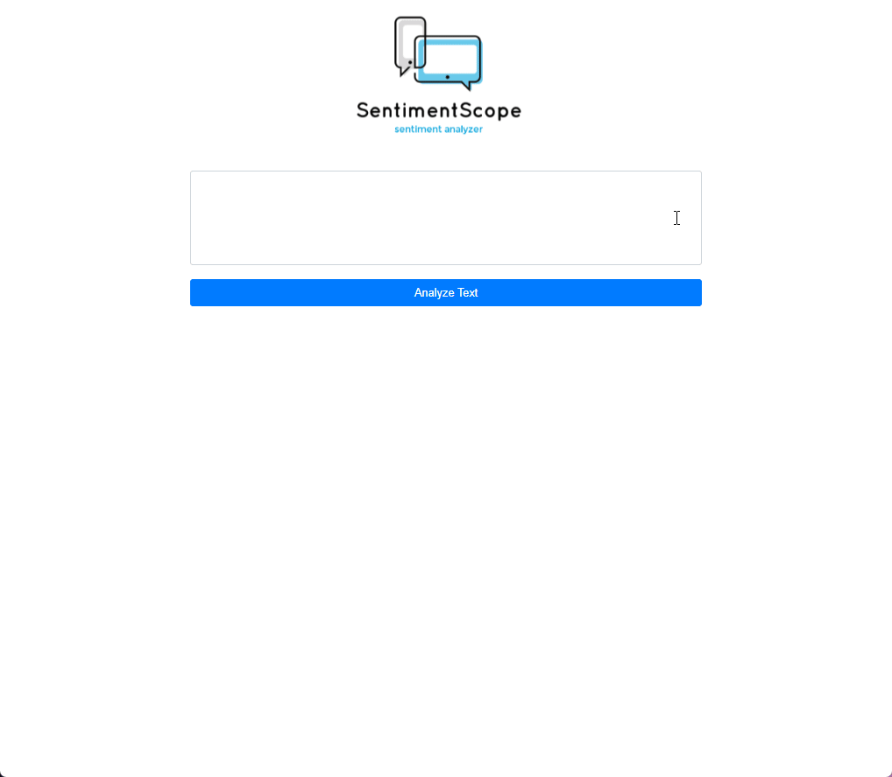
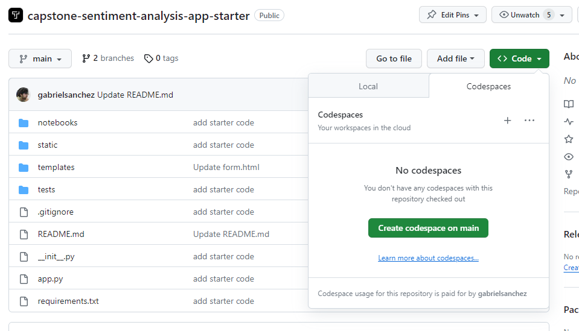
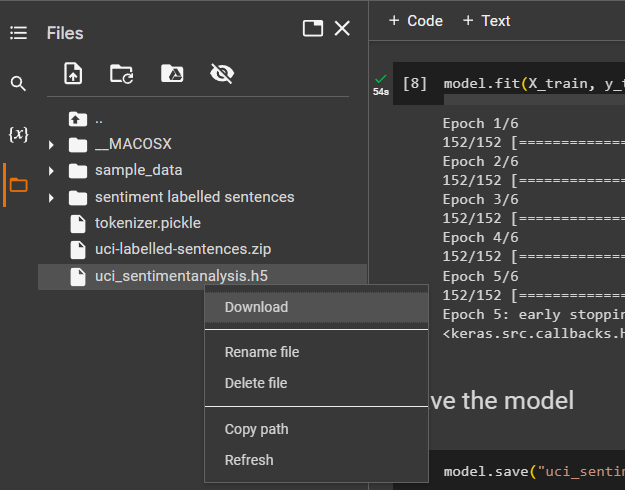
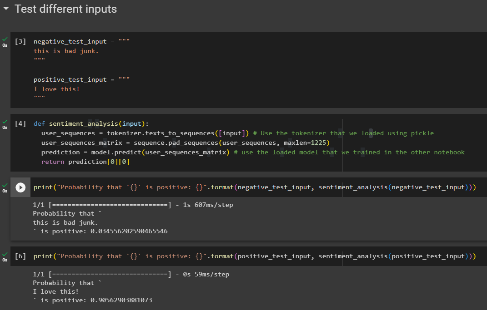
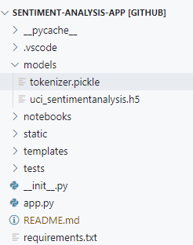

# Capstone: Sentiment Analysis App

> You have been hired as a developer at *SentimentScope*, a startup that is creating a sentiment analysis app for businesses. The software is meant for business owners who want to measure and understand customer sentiment from feedback and reviews. The app will serve as a prototype that allows your clients to test different sentiment analysis models with their own inputs.



## Existing Files

The most relevant files in the project are the following:

| File name     | Description                                                                                  |
|---------------|----------------------------------------------------------------------------------------------|
| app.py        | The main application file. It contains the code for the application.                         |
| templates/form.html     | The template file for the application. It defines the structure and layout of the web form.  |
| static/style.css      | The CSS stylesheet for the application. It defines the visual style of the web form.         |
| tests/test.py       | The pytest unit test file. It contains test cases to ensure the functionality of the code.   |
| notebooks/Vader_Sentiment_Analysis.ipynb   | A colab notebook that demonstrates how to use the VADER library for sentiment analysis.      |

You will mostly work with the `app.py` and `form.html` files.

#### Custom model files

You will need to create and upload the following files:

| File name     | Description                                                                                  |
|---------------|----------------------------------------------------------------------------------------------|
| notebooks/UCI_Sentiment_Analysis.ipynb   | The notebook that you use to create your own model. You will create and upload this file.      |
| models/tokenizer.pickle   | The tokenizer object used for predicting sentiment analysis. You will create and upload this file.      |
| models/uci_sentimentanalysis.h5   | Your keras sentiment analysis model. You will create and upload this file.      |

## Installation

1. Fork this repository.
2. Create a Codespace for your project.



3. GitHub Codespaces will automatically create a fully-configured development environment for your project in the cloud. If you need to install the requirements manually run: `pip install -r requirements.txt`
4. To run the app, use the following command: `python app.py` or `gunicorn app:app`
5. To run the tests, use the following command: `pytest tests/*.py`

> **Note:** It's not required to pass all the unit tests to complete this assessment, but it is recommended that you use the tests as a guide to deliver a functional application and meet the rubric requirements.

## Product Backlog

> The product manager has already created the user stories for _SentimentScope - Sentiment Analyzer_. Each of the user stories is listed below, and your product manager wants them to be implemented in the order in which they are listed. Another developer has already written the tests for the application so that you don't have to.

Each of the user stories is listed below. The user stories are to be implemented in the order in which they are listed. Find the *TODO* comments in the code and create the necessary functionality.

### US-01 Implement VADER in the App

[VADER (Valence Aware Dictionary and sEntiment Reasoner)](https://github.com/cjhutto/vaderSentiment) is a popular open-source tool for sentiment analysis of text. It is specifically designed to analyze social media texts, but can be used for any form of text that needs sentiment analysis. VADER uses a combination of a sentiment lexicon (a list of words with assigned sentiment scores) and grammatical rules to determine the <i>sentiment</i> of a text, or whether it is positive, negative, or neutral. The sentiment scores generated by VADER can also reflect the intensity or strength of the sentiment. VADER is known for its effectiveness in handling noisy, informal, and contextualized text data.

Here is an example of how to get the sentiment analysis of a text with VADER:

```python
from vaderSentiment.vaderSentiment import SentimentIntensityAnalyzer
sid = SentimentIntensityAnalyzer()
s = sid.polarity_scores("hey! this is bad!")
print(s)
```

Output:
```
{'neg': 0.577, 'neu': 0.423, 'pos': 0.0, 'compound': -0.6229}
```

The output returns a dictionary with the results. In this case, the string "hey! this is bad!" is thought to be 0.577 negative, 0.423 neutral, and 0.0 positive according to VADER.

#### 1. Get familiar with VADER.

Use [this](https://colab.research.google.com/drive/1HWuqiFI7GpJ0YgdOh6o4EFj54MWU61Od#scrollTo=e8Vid3xUG9H0) Colab notebook to get familiar with Vader.

#### 2. Add the VADER analyzer in app.py

Import and use VADER in your application so that it calculates the sentiment analysis scores for the input given by a user. 

> **Tip**: Use `text = request.form.get("user_text")` to get the text from the form.

> **Tip**: Use `sentiment = analyzer.polarity_scores(text)` to calculate the scores.

#### 3. Modify `form.html` so that it prints the scores.

Add the sentiment analysis results that are returned by VADER to `form.html`.

Multiply the results by 100 so that it prints a percentage, such as`{{ sentiment['pos'] * 100 }}`.

Overall, it should look something like the following code:

```html
    
        <p>Positive: {{ sentiment['pos'] * 100 }}%</p>
        <!-- add the negative, neutral and compound scores here-->
    
```

#### Acceptance Criteria

1. The app uses the VADER analyzer to calculate results.
2. Positive, negative, neutral, and compound scores are displayed after hitting the submit button.

### US-02 Build a Custom Keras Model

To set your product apart from others using VADER, you can enhance it by developing tailor-made sentiment analysis models for your clients. It is important for your application to demonstrate that it can accomodate custom sentiment analysis models. In this step, you will construct a personalized sentiment analysis model using Keras.

You will use the [UCI Labelled Sentences dataset](https://archive.ics.uci.edu/dataset/331/sentiment+labelled+sentences) for this step. The dataset consists of a collection of sentences that have been labeled with their respective sentiment or category. Each sentence in the dataset is labeled with a specific category or sentiment. 

Create a [new Colab notebook](https://colab.research.google.com/) and proceed with the steps described below:

> **Tip**: Feel free to experiment with the code snippets provided below to see how the accuracy of the model is affected.

#### 1. Download the dataset and unzip it in Google Colab

Use the following commands to download and unzip the UCI Labelled Sentences dataset in your Colab notebook:

```bash
# download dataset from the UCI website
!curl -o uci-labelled-sentences.zip https://archive.ics.uci.edu/static/public/331/sentiment+labelled+sentences.zip

# unzip dataset in Colab
!unzip uci-labelled-sentences.zip
```

#### 2. Import Keras and other libraries

Import the necessary libraries for data manipulation and deep-learning modeling. Include the following code in your notebook:

```python
import pandas as pd
import pickle
from sklearn.model_selection import train_test_split
from keras.preprocessing.text import Tokenizer
from keras.preprocessing.sequence import pad_sequences
from keras.models import Sequential
from keras.layers import Dense, Embedding, LSTM
from keras.callbacks import EarlyStopping
```

#### 3. Load the datasets

The datasets include data from Yelp, Amazon, and IMDB, each with labeled sentences. Load the datasets using the following code:

```python
df_list = []

# Yelp
df_yelp = pd.read_csv('sentiment labelled sentences/yelp_labelled.txt', names=['sentence', 'label'], sep='\t')
df_yelp['source'] = 'yelp'
df_list.append(df_yelp)

# Amazon
df_amazon = pd.read_csv('sentiment labelled sentences/amazon_cells_labelled.txt', names=['sentence', 'label'], sep='\t')
df_amazon['source'] = 'amazon'
df_list.append(df_amazon)

# IMDB
df_imdb = pd.read_csv('sentiment labelled sentences/imdb_labelled.txt', names=['sentence', 'label'], sep='\t')
df_imdb['source'] = 'imdb'
df_list.append(df_imdb)

# Concatenate the dataframes
df = pd.concat(df_list)

df.head()
```

> **Note**: The code above creates a list called `df_list` to store multiple pandas dataframes. Each dataframe corresponds to a dataset from sources like Yelp, Amazon, and IMDB. The code reads the CSV files of these datasets and assigns column names ('sentence' and 'label') to the dataframe. It also adds a new column, 'source', to each dataframe to indicate the source of the data. Finally, the code concatenates all the dataframes in `df_list` into a single dataframe called `df`. This allows for a combined dataset from multiple sources.

#### 4. Tokenize

Tokenize the sentences by converting them into sequences of numbers using the Tokenizer class. Include the code segment below:

```python
max_features = 2000
tokenizer = Tokenizer(num_words=max_features, split=' ')
tokenizer.fit_on_texts(df['sentence'].values)
X = tokenizer.texts_to_sequences(df['sentence'].values)
X = pad_sequences(X)
y = df['label'].values
```

#### 5. Split the dataset

Split the dataset into training and test sets using the `train_test_split` function from sklearn.

```python 
X_train, X_test, y_train, y_test = train_test_split(X, y, test_size=0.12)
```

#### 6. Define the model

Create the sentiment analysis model using Keras. The model includes an embedding layer, LSTM layer, and dense layer. Here's an example of how to define the model:

```python
def create_model():
  model = Sequential()
  model.add(Embedding(max_features, 64, input_length=X.shape[1]))
  model.add(LSTM(16))
  model.add(Dense(1, activation='sigmoid'))
  model.compile(loss='binary_crossentropy', optimizer='adam', metrics=['accuracy'])
  return model

model = create_model()
```

#### 7. Train the model

Train the model using the training set and evaluate its performance on the test set. Include the code below:

```python
model.fit(X_train, y_train, epochs=6, batch_size=16, validation_data=(X_test, y_test), callbacks = [EarlyStopping(monitor='val_accuracy', min_delta=0.001, patience=2, verbose=1)])
```

#### 8. Save the model and the tokenizer

Use the code below to save the trained model and tokenizer for future use.

```python
model.save("uci_sentimentanalysis.h5")

with open('tokenizer.pickle', 'wb') as handle:
    pickle.dump(tokenizer, handle, protocol=pickle.DEFAULT_PROTOCOL)
```

#### 9. Download the model and tokenizer to your computer

The tokenizer and the trained model are ready to be used in your app. Download the files to your computer.



#### Acceptance criteria

1. A notebook was created and used to produce the tokenizer and the model.
2. The notebook is included in the `notebooks` folder.

### US-03 Test your model

You now have a model and a tokenizer that can be used in your app. You will need to test that the model and tokenizer files that you created work as expected before integrating them into your Flask application.

Use [this Colab notebook](https://colab.research.google.com/drive/1neUIezfOo2qmeysWkCHhla2VitGpm5e-?usp=sharing) to test that your model and tokenizer work as expected.

#### 1. Upload the tokenizer and model to Google Colab.

Upload the `tokenizer.pickle` and `uci_sentimentanalysis.h5` files to the Google Colab environment that you are working on. 


#### 2. Run the code in the notebook.

Run the code in the notebook to verify that your model works. The output should look similar to the screenshot below.



#### Acceptance criteria

1. The model and the tokenizer work as expected.

### US-04 Integrate the model and tokenizer in your application

#### 1. Add the tokenizer and model

Add the tokenizer and model in your `models` folder.



#### 2. Import the libraries in `app.py`

Your imports should look similar to the code segment below.

```python
import pickle
from tensorflow.keras.models import load_model
from tensorflow.keras.preprocessing import sequence

from flask import Flask, render_template, request
from vaderSentiment.vaderSentiment import SentimentIntensityAnalyzer
```

#### 3. Load the model and the tokenizer in Flask

Use the code below to load the keras model and the tokenizer.

```python
model = None
tokenizer = None

def load_keras_model():
    global model
    model = load_model('models/uci_sentimentanalysis.h5')

def load_tokenizer():
    global tokenizer
    with open('models/tokenizer.pickle', 'rb') as handle:
        tokenizer = pickle.load(handle)

@app.before_first_request
def before_first_request():
    load_keras_model()
    load_tokenizer()
```

> **Tip**: To avoid a memory leak, it's necessary to load the tokenizer and keras files exactly as shown in the snippet above. Loading models without using the `@app.before_first_request` decorator may lead to a [memory leak](https://github.com/keras-team/keras/issues/7271).

#### 4. Define the sentiment_analysis() function

The sentiment analysis method will calculate the sentiment analysis score. Preprocessing the text as you did in the notebook is necessary for the model to work correctly. The code snippet below returns the rounded result of the prediction.

```python
def sentiment_analysis(input):
    user_sequences = tokenizer.texts_to_sequences([input])
    user_sequences_matrix = sequence.pad_sequences(user_sequences, maxlen=1225)
    prediction = model.predict(user_sequences_matrix)
    return round(float(prediction[0][0]),2)
```

#### 5. Call the sentiment_analysis() function

Call the `sentiment_analysis()` function to calculate the sentiment analysis score with the user input. Add the result to the `sentiment` dictionary where you are already storing the VADER results.

```python
sentiment = analyzer.polarity_scores(text) # VADER results
# create a new key in the dictionary to store the custom model sentiment analysis results
sentiment["custom model positive"] = sentiment_analysis(text)
```
>**Note:** If you encounter errors while loading an H5 file into your application, it could indicate that the file got corrupted during the upload process or when it was generated. If you encounter an error of this nature, it is recommended that you generate a new H5 file. The simplest solution is to re-upload the H5 file, as this often resolves file corruption issues. By creating a fresh file, you can ensure the integrity of your data and minimize potential errors during file loading.

#### 6. Update `form.html` to include your custom model's result

Display the result in `form.html`:

```
{{ sentiment['custom model positive'] }}
```

#### Acceptance Criteria

1. Your custom sentiment analysis model is used in the app.
2. The model's prediction is displayed in the app.

### US-05 Improve the UI

The user interface design is completely up to you. Feel free to use ChatGPT or another AI assistant to build the UI.

Here are some examples of what your app may look like:

#### Example 1:

 

#### Example 2:


> **Tip**: If you want to integrate plotly charts (as shown in the Example 2 screenshot), feel free to adapt [this code](https://codepen.io/hoketus/pen/LYMwLgG?editors=1000) in your app.

#### Aceptance Criteria

1. The app displays the results of the sentiment analysis prediction.
2. An original UI design is used in the app.

### US-06 Deployment

You made it! You finished the first version of your app. Now, it's time to deploy that app so that it can be tested by your clients. 

#### 1. Deploy your app on Render

Deploy the app on Render so that it becomes part of your portfolio. Use the following settings in Render to build and start the app:

1. **Build command**: `pip install --upgrade pip && pip install -r requirements.txt`

2. **Start command**: `gunicorn app:app`


#### 2. Set the PYTHON_VERSION environment variable

Render uses an older version of Python as default but this can be easily changed by setting an environment variable. Inside the Environment tab, create a new environment variable called `PYTHON_VERSION` and set its value to `3.10.12`. This will ensure that Render uses Python version 3.10.12 (the same version that you used in your notebook) for your app. Refer to the screenshot below for a visual guide.


> **Note:** Render automatically spins down a [free web service](https://render.com/docs/free#:~:text=Render%20spins%20down%20a%20Free,is%20back%20up%20and%20running.) if it remains inactive for 15 minutes without any incoming traffic. When a request is received, Render promptly spins up the service. However, the spinning up process may take a few seconds or, in some cases, up to a couple of minutes. During this time, there might be a noticeable delay for incoming requests, resulting in brief moments of hanging or slower page loads in a browser.

#### Aceptance Criteria

1. The project is deployed on Render.

## Success criteria

Functionality:

- The app displays the sentiment analysis predictions using VADER.
- The app displays the sentiment analysis predictions using a custom sentiment analysis Keras model.
- A model was trained using the UCI sentiment labelled sentences dataset and the notebook is included in the repository.
- An original user interface was created for the app.

General code organization:

- Minimal code duplication
- Comments are used to describe the functions.


## Tips

- Follow the order of the user stories.
- If you are stuck, take a careful look at the provided resources. If you are still stuck, ask a friend or a mentor for help.
- Read the user stories and tests carefully.
